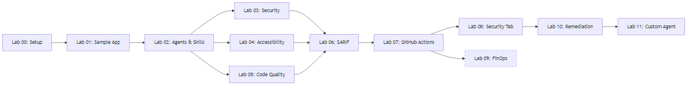

# Agentic Accelerator Workshop

> Learn to use AI-powered Accelerator agents — from Agents to Hero

This hands-on workshop teaches you how to integrate GitHub Copilot custom agents
into your Accelerator workflows. You will configure security scanners, accessibility
checkers, code quality analyzers, and FinOps cost gates, all powered by AI agents
that produce SARIF-compliant findings visible in the GitHub Security tab.

By the end of this workshop you will be able to run automated security, accessibility,
and code quality scans from your IDE and CI/CD pipelines, interpret SARIF output,
and build your own custom agent.

## Who Is This For?

| Audience | What You Will Learn |
|---|---|
| **Developers** | Run AI-powered scans from VS Code using Copilot agents |
| **DevOps Engineers** | Wire agent-driven workflows into GitHub Actions pipelines |
| **Security Engineers** | Understand SARIF output and integrate findings into governance |
| **Platform Engineers** | Extend the framework with custom agents for your organization |

## Prerequisites

Before starting Lab 00, ensure you have the following:

- [Visual Studio Code](https://code.visualstudio.com/) (latest stable)
- [Node.js](https://nodejs.org/) v20 or later
- [Git](https://git-scm.com/) 2.40 or later
- A [GitHub account](https://github.com/) with
  [GitHub Copilot](https://github.com/features/copilot) access
- GitHub Copilot Chat extension installed in VS Code

## Labs

Work through the labs in order. Each lab builds on the previous one.

- [ ] [Lab 00 - Prerequisites and Environment Setup](labs/lab-00-setup.md) _(30 min, Beginner)_
- [ ] [Lab 01 - Explore the Sample App](labs/lab-01.md) _(25 min, Beginner)_
- [ ] [Lab 02 - Understanding Agents, Skills, and Instructions](labs/lab-02.md) _(20 min, Beginner)_
- [ ] [Lab 03 - Security Scanning with Copilot Agents](labs/lab-03.md) _(40 min, Intermediate)_
- [ ] [Lab 04 - Accessibility Scanning with Copilot Agents](labs/lab-04.md) _(35 min, Intermediate)_
- [ ] [Lab 05 - Code Quality Analysis with Copilot Agents](labs/lab-05.md) _(35 min, Intermediate)_
- [ ] [Lab 06 - Understanding SARIF Output](labs/lab-06.md) _(30 min, Intermediate)_
- [ ] [Lab 07 - Setting Up GitHub Actions Pipelines](labs/lab-07.md) _(40 min, Intermediate)_
- [ ] [Lab 08 - Viewing Results in GitHub Security Tab](labs/lab-08.md) _(25 min, Intermediate)_
- [ ] [Lab 09 - FinOps Agents and Azure Cost Governance](labs/lab-09.md) _(45 min, Advanced)_ ⭐ Optional
- [ ] [Lab 10 - Agent Remediation Workflows](labs/lab-10.md) _(45 min, Advanced)_
- [ ] [Lab 11 - Creating Your Own Custom Agent](labs/lab-11.md) _(45 min, Advanced)_

## Delivery Tiers

Choose the tier that fits your schedule:

| Tier | Labs | Duration | Audience |
|---|---|---|---|
| **Half-Day** | Labs 00 – 05 | ~3 hours | First exposure to agent-driven scanning |
| **Full-Day** | Labs 00 – 08 | ~5.5 hours | End-to-end pipeline integration |
| **Extended** | Labs 00 – 11 | ~7.5 hours | Deep dive including FinOps, remediation, and custom agents |

## Lab Dependency Diagram

Labs 03, 04, and 05 can be completed in any order. Lab 09 is optional and does
not block later labs.

## Getting Started

1. Click **"Use this template"** at the top of this repository to create your
   own copy.
2. Clone the new repository to your local machine.
3. Open the repository in VS Code.
4. Start with [Lab 00 - Prerequisites and Environment Setup](labs/lab-00-setup.md).

## Credits

This workshop is built on the
[Agentic Accelerator Framework](https://github.com/devopsabcs-engineering/agentic-accelerator-framework),
which provides the agents, skills, instructions, and sample application used
throughout the labs.

## License

This project is licensed under the [MIT License](LICENSE).
