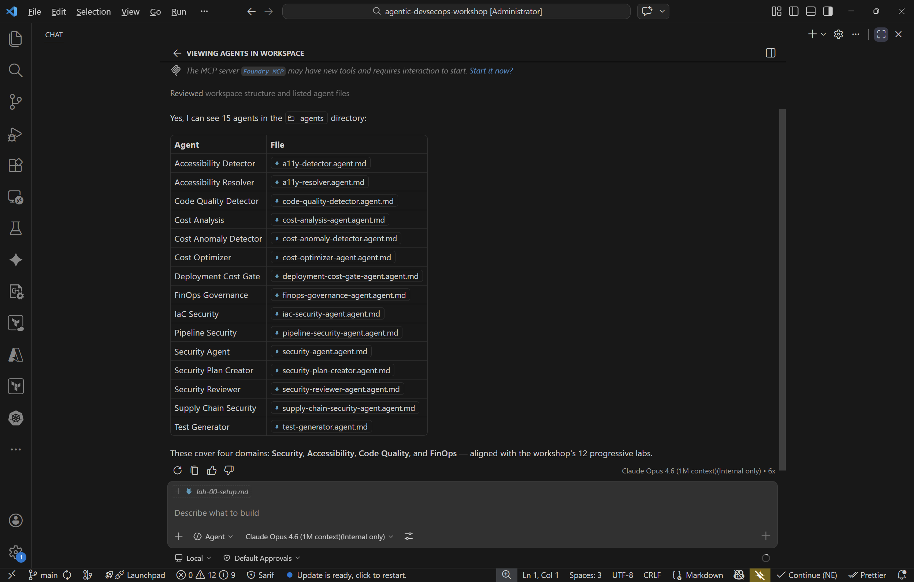

## Overview

| | |
|---|---|
| **Duration** | 30 minutes |
| **Level** | Beginner |
| **Prerequisites** | None |

## Learning Objectives

By the end of this lab, you will be able to:

* Install the required tools (Node.js v20+, Git, VS Code)
* Install the four VS Code extensions used throughout the workshop
* Create your own repository from the workshop template
* Verify that GitHub Copilot Chat is working and can see the workspace agents

## Exercises

### Exercise 0.1: Install Required Tools

You need three tools on your machine before starting the workshop. If you already have them installed, confirm the minimum versions below.

1. **Node.js v20 or later** — download from <https://nodejs.org> if you do not have it.

   Open a terminal and run:

   ```bash
   node --version
   ```

   Confirm the output shows `v20.x.x` or higher.

2. **Git** — download from <https://git-scm.com> if you do not have it.

   ```bash
   git --version
   ```

3. **Visual Studio Code** — download from <https://code.visualstudio.com> if you do not have it.

   ```bash
   code --version
   ```


### Exercise 0.2: Install VS Code Extensions

Open VS Code and install the following four extensions from the Extensions panel (`Ctrl+Shift+X`):

| Extension | ID |
|---|---|
| GitHub Copilot | `github.copilot` |
| GitHub Copilot Chat | `github.copilot-chat` |
| SARIF Viewer | `MS-SarifVSCode.sarif-viewer` |
| ESLint | `dbaeumer.vscode-eslint` |

You can also install them from the terminal:

```bash
code --install-extension github.copilot
code --install-extension github.copilot-chat
code --install-extension MS-SarifVSCode.sarif-viewer
code --install-extension dbaeumer.vscode-eslint
```

After installation, confirm all four extensions appear as enabled in the Extensions panel.


### Exercise 0.3: Create Your Workshop Repository

1. Navigate to <https://github.com/devopsabcs-engineering/agentic-accelerator-workshop> in your browser.
2. Click **Use this template** and then select **Create a new repository**.
3. Set the repository name to `agentic-accelerator-workshop` under your personal GitHub account.
4. Set visibility to **Public** (required for GitHub Security tab features in later labs).
5. Click **Create repository**.
6. Clone the repository to your local machine:

   ```bash
   git clone https://github.com/<your-username>/agentic-accelerator-workshop.git
   ```

7. Open the repository in VS Code:

   ```bash
   code agentic-accelerator-workshop
   ```

### Exercise 0.4: Verify Copilot Chat

1. Open the Copilot Chat panel (`Ctrl+Shift+I` on Windows or `Cmd+Shift+I` on macOS).
2. Type the following message:

   ```text
   Hello, can you see the agents in this workspace?
   ```

3. Copilot should respond with a list of agents it can see (for example, `@security-agent`, `@a11y-detector`).
4. If Copilot does not list any agents, confirm the `.github/agents/` folder is present in your workspace and the Copilot extensions are enabled.



## Verification Checkpoint

Before proceeding, verify:

* [ ] `node --version` returns v20.x.x or higher
* [ ] All four VS Code extensions are installed and enabled
* [ ] Your workshop repository is created from the template and cloned locally
* [ ] Copilot Chat responds and lists workspace agents

## Next Steps

Proceed to [Lab 01 — Explore the Sample App](lab-01.md).