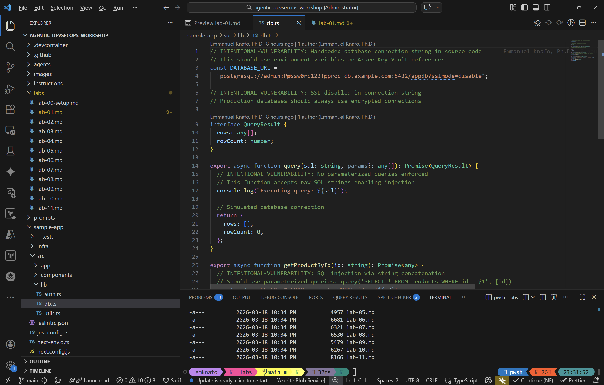
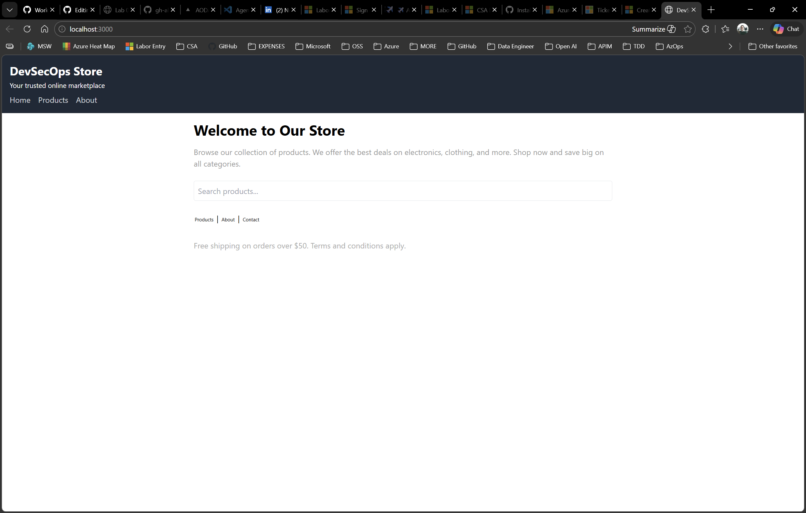

## Overview

| | |
|---|---|
| **Duration** | 25 minutes |
| **Level** | Beginner |
| **Prerequisites** | [Lab 00](lab-00-setup.md) |

## Learning Objectives

By the end of this lab, you will be able to:

* Navigate the workshop repository structure and identify key directories
* Identify the four agent domains: Security, Accessibility, Code Quality, and FinOps
* Run the sample Next.js application locally
* Discover the intentional vulnerabilities planted in the sample app

## Exercises

### Exercise 1.1: Explore the Repository Structure

Open the VS Code Explorer (`Ctrl+Shift+E`) and review the top-level directory layout:

| Directory | Purpose |
|---|---|
| `.github/agents/` | Custom Copilot agent definitions (one `.agent.md` file per agent) |
| `.github/instructions/` | Always-on rules that Copilot applies automatically based on `applyTo` globs |
| `.github/prompts/` | Reusable prompt templates invoked on demand |
| `.github/skills/` | Domain knowledge packages loaded by agents when they need deep context |
| `sample-app/` | A Next.js application with intentional security, accessibility, and FinOps issues |

Take a moment to expand each directory and note how many files it contains.


### Exercise 1.2: Review Intentional Issues

The sample app includes deliberate vulnerabilities for agents to detect in later labs. Open each file below, find the `INTENTIONAL-VULNERABILITY` comments, and note what you see.

1. **`sample-app/src/lib/auth.ts`** — Weak cryptography and predictable tokens.
   * `Math.random()` used for session token generation (line 38–39)
   * `md5` used for password hashing (line 12)
   * Hardcoded JWT secret and API key (lines 4–7)

2. **`sample-app/src/lib/db.ts`** — SQL injection via string concatenation.
   * `getProductById()` builds SQL with string interpolation (line 33)
   * `searchProducts()` does the same (line 39)
   * Hardcoded database connection string with plaintext credentials (line 4)

3. **`sample-app/src/components/ProductCard.tsx`** — Cross-site scripting (XSS).
   * `dangerouslySetInnerHTML` renders unsanitized user-supplied descriptions (line 24)

4. **`sample-app/infra/main.bicep`** — Oversized SKUs and security misconfigurations.
   * Premium V3 App Service Plan for a sample app (line 28)
   * GRS storage replication where LRS would suffice (line 68)
   * HTTP traffic allowed, TLS 1.0 permitted (lines 51–53)
   * Plaintext SQL admin password as a parameter (line 16)



### Exercise 1.3: Run the Sample App

1. Open a terminal in VS Code (`Ctrl+`` `) and navigate to the sample app:

   ```bash
   cd sample-app
   ```

2. Install dependencies:

   ```bash
   npm install
   ```

3. Start the development server:

   ```bash
   npm run dev
   ```

4. Open <http://localhost:3000> in your browser.
5. Browse the products page and click on a product to view its details page.
6. When you are done exploring, stop the dev server with `Ctrl+C`.



### Exercise 1.4: Note the Template Creation Flow

When other participants join the workshop, they will create their own repository from this template using the GitHub **Use this template** button. This is the same step you completed in Lab 00, Exercise 0.3.

Take note of how the template preserves the full directory structure, agent definitions, and sample app so every student starts from the same baseline.


## Verification Checkpoint

Before proceeding, verify:

* [ ] You can identify the five key directories (`.github/agents/`, `.github/instructions/`, `.github/prompts/`, `.github/skills/`, `sample-app/`)
* [ ] You found at least three intentional vulnerabilities by file name
* [ ] The sample app runs locally at <http://localhost:3000>
* [ ] You understand that the four agent domains are Security, Accessibility, Code Quality, and FinOps

## Next Steps

Proceed to [Lab 02 — Understanding Agents, Skills, and Instructions](lab-02.md).