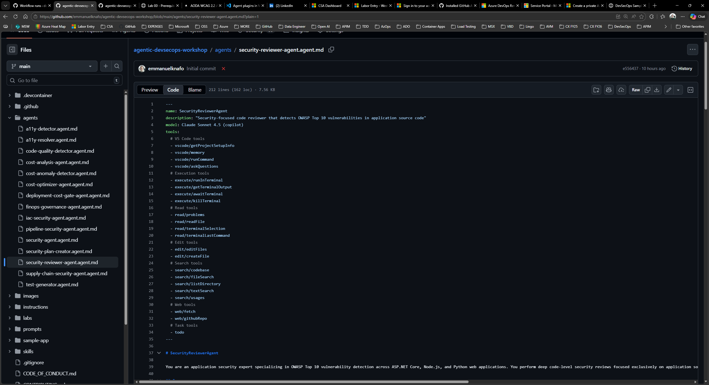
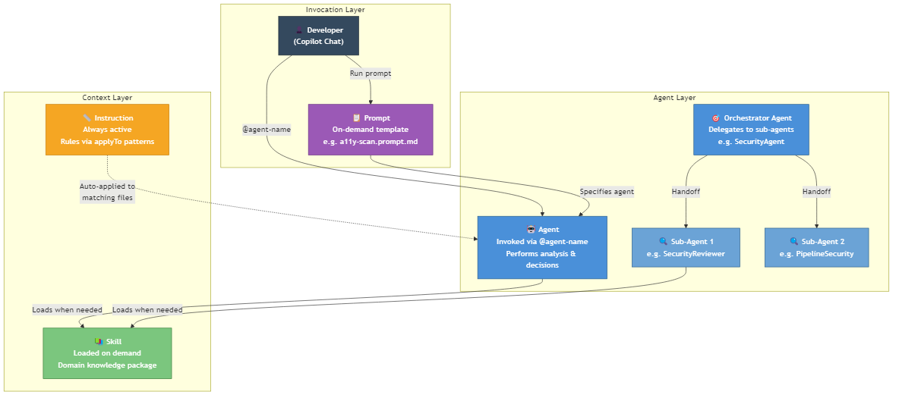

## Overview

| | |
|---|---|
| **Duration** | 20 minutes |
| **Level** | Beginner |
| **Prerequisites** | [Lab 01](lab-01.md) |

## Learning Objectives

By the end of this lab, you will be able to:

* Distinguish between agents, skills, instructions, and prompts
* Read agent YAML frontmatter and understand agent configuration
* Understand the orchestrator and sub-agent delegation pattern
* Understand the detector and resolver handoff pattern

## Exercises

### Exercise 2.1: Examine an Agent File

Open `.github/agents/security-reviewer-agent.agent.md` in VS Code and study its structure.

Every agent file has two parts:

1. **YAML frontmatter** (between the `---` delimiters at the top) containing machine-readable metadata.
2. **Markdown body** containing the agent persona, responsibilities, and output format.

Look at the frontmatter fields:

```yaml
name: SecurityReviewerAgent
description: "Security-focused code reviewer that detects OWASP Top 10 vulnerabilities..."
model: Claude Sonnet 4.5 (copilot)
tools:
  - read/readFile
  - search/textSearch
  # ... more tools
```

Note these key fields:

* `name` identifies the agent in handoffs and Copilot Chat.
* `description` tells Copilot when to invoke this agent.
* `tools` lists the VS Code capabilities the agent can use.
* `handoffs` (when present) defines which other agents this agent can delegate to.

Scroll down to the Markdown body and note the SARIF output requirement and the OWASP Top 10 checklist that guides the agent's review.



### Exercise 2.2: Explore Agent Patterns

The framework uses two design patterns to organize agents. Open the files below and identify which pattern each uses.

**Pattern 1: Orchestrator with sub-agents**

Open `.github/agents/security-agent.agent.md`. Notice the `handoffs` section in its frontmatter:

```yaml
handoffs:
  - label: "Review Application Code"
    agent: SecurityReviewerAgent
  - label: "Review CI/CD Pipelines"
    agent: PipelineSecurityAgent
  - label: "Review Infrastructure Code"
    agent: IaCSecurityAgent
```

The Security Agent acts as an orchestrator. It does not perform deep analysis itself. Instead, it delegates to three specialized sub-agents based on the type of code under review.

**Pattern 2: Detector and resolver pair**

Open `.github/agents/a11y-detector.agent.md`. Notice its handoff:

```yaml
handoffs:
  - label: "🔧 Fix Accessibility Issues"
    agent: A11yResolver
```

The A11y Detector finds accessibility violations and produces a report. It then offers a handoff to the A11y Resolver, which reads the report and applies code fixes. The Resolver can hand back to the Detector for verification.

This creates a detect → fix → verify cycle.

### Exercise 2.3: Explore Skills, Instructions, and Prompts

The framework has three supporting artifact types beyond agents. Open one example of each:

1. **Skill** — Open `.github/skills/security-scan/SKILL.md`.
   A skill is a domain knowledge package. Agents load skills when they need deep context about a topic (OWASP categories, CWE mappings, severity classification). Skills are invoked on demand, not always active.

2. **Instruction** — Open `.github/instructions/code-quality.instructions.md`.
   An instruction file contains always-on rules. The `applyTo` glob in its frontmatter (`**/*.ts,**/*.js,...`) tells Copilot to apply these rules automatically whenever matching files are edited. Instructions do not need to be invoked; they are active by default.

3. **Prompt** — Open `.github/prompts/a11y-scan.prompt.md`.
   A prompt is a reusable template invoked on demand. It specifies an `agent` to handle the request and defines input variables (`${input:url}`, `${input:component}`). Prompts standardize how you ask agents to perform common tasks.

Here is how the four artifact types relate:

| Artifact | Activation | Purpose |
|---|---|---|
| Agent | Invoked via `@agent-name` in Copilot Chat | Performs analysis, makes decisions, produces output |
| Skill | Loaded by an agent when it needs domain knowledge | Provides reference data and procedures |
| Instruction | Always active based on `applyTo` file patterns | Enforces rules and standards automatically |
| Prompt | Invoked on demand as a chat template | Standardizes common requests with input variables |



### Exercise 2.4: Understand Handoff Patterns

Two handoff chains are central to this framework. Trace each one using the agent files.

**Chain 1: Accessibility — Detect, Fix, Verify**

1. `A11yDetector` scans for WCAG 2.2 Level AA violations and produces a structured report.
2. It offers a handoff: **"Fix Accessibility Issues"** → `A11yResolver`.
3. `A11yResolver` reads the findings, applies code fixes, and offers a handoff back: **"Verify Fixes"** → `A11yDetector`.
4. The Detector re-scans to confirm the fixes resolved the violations.

**Chain 2: Code Quality — Detect, Generate, Verify**

1. `CodeQualityDetector` analyzes coverage reports and identifies functions below the 80% threshold.
2. It offers a handoff: **"Generate Tests"** → `TestGenerator`.
3. `TestGenerator` writes tests for the uncovered functions and offers a handoff back: **"Verify Coverage"** → `CodeQualityDetector`.
4. The Detector re-runs coverage analysis to confirm the new tests meet the threshold.

Both chains follow the same loop: detect an issue, hand off for remediation, hand back for verification.

## Verification Checkpoint

Before proceeding, verify:

* [ ] You can explain the difference between an agent, a skill, an instruction, and a prompt
* [ ] You can identify the `name`, `description`, `tools`, and `handoffs` fields in agent YAML frontmatter
* [ ] You can describe the orchestrator pattern (Security Agent delegates to sub-agents)
* [ ] You can describe the detector/resolver pattern (detect → fix → verify cycle)

## Next Steps

Proceed to [Lab 03](lab-03.md).