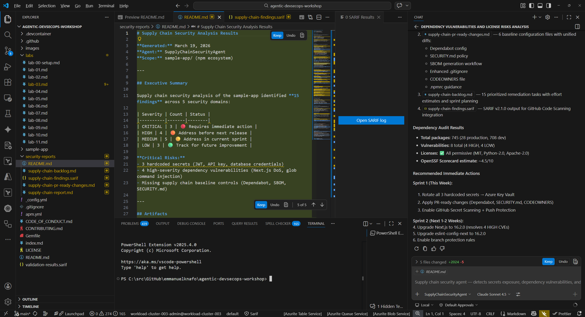
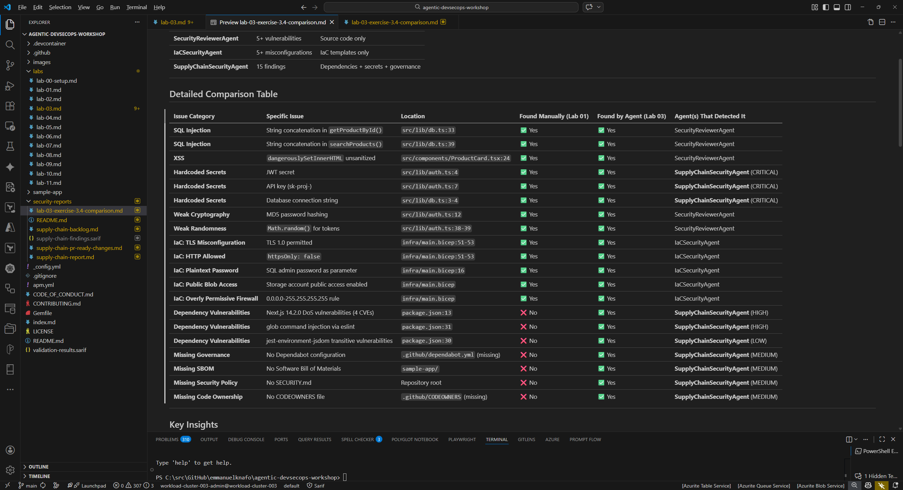

## Overview

| | |
|---|---|
| **Duration** | 40 minutes |
| **Level** | Intermediate |
| **Prerequisites** | [Lab 00](lab-00-setup.md), [Lab 01](lab-01.md), [Lab 02](lab-02.md) |

## Learning Objectives

By the end of this lab, you will be able to:

* Run the security-reviewer-agent to find OWASP Top 10 vulnerabilities in source code
* Run the iac-security-agent to find infrastructure misconfigurations in Bicep templates
* Run the supply-chain-security-agent to find dependency risks in package manifests
* Interpret security findings with CWE IDs and severity levels

## Exercises

### Exercise 3.1: Source Code Security Scanning

In this exercise you use the Security Reviewer Agent to scan the sample app source code for common vulnerabilities.

1. Open the Copilot Chat panel (`Ctrl+Shift+I`).
2. Type the following prompt:

   ```text
   @security-reviewer-agent Scan sample-app/src/ for OWASP Top 10 vulnerabilities. Report findings with CWE IDs and severity.
   ```

3. Wait for the agent to complete its analysis. Review the output and look for these categories of findings:

   | Finding | CWE | File |
   |---|---|---|
   | SQL injection via string concatenation | CWE-89 | `sample-app/src/lib/db.ts` |
   | Cross-site scripting (XSS) via `dangerouslySetInnerHTML` | CWE-79 | `sample-app/src/components/ProductCard.tsx` |
   | Hardcoded secrets (JWT secret, API key) | CWE-798 | `sample-app/src/lib/auth.ts` |
   | Weak cryptographic hashing (MD5) | CWE-328 | `sample-app/src/lib/auth.ts` |
   | Predictable token generation (`Math.random()`) | CWE-330 | `sample-app/src/lib/auth.ts` |

4. Note the severity level assigned to each finding. Critical and High findings represent immediate risks that should be addressed before deployment.


### Exercise 3.2: Infrastructure Security Scanning

Next, scan the infrastructure-as-code template for security misconfigurations.

1. In Copilot Chat, type:

   ```text
   @iac-security-agent Scan sample-app/infra/main.bicep for security misconfigurations
   ```

2. Review the findings. The agent should identify issues such as:

   * Public blob access enabled on the storage account
   * TLS 1.0 permitted (minimum TLS version should be 1.2)
   * HTTP traffic allowed (HTTPS should be enforced)
   * Overly permissive firewall rules
   * Plaintext SQL administrator password passed as a parameter

3. For each finding, note the line number in `main.bicep` and the recommended remediation.


### Exercise 3.3: Supply Chain Security

Now analyze the project dependencies for known vulnerabilities and license risks.

1. In Copilot Chat, type:

   ```text
   @supply-chain-security-agent Analyze sample-app/package.json for dependency vulnerabilities and license risks
   ```

2. Review the findings. Common issues include:

   * Dependencies with known CVEs
   * Missing lockfile integrity checks
   * Outdated packages with available security patches
   * License compatibility concerns

3. Note which dependencies the agent flags and the recommended upgrade paths.



### Exercise 3.4: Compare Findings Against Known Issues

In Lab 01 you manually reviewed the sample app and identified intentional vulnerabilities. Now compare those manual findings against the agent results.

1. Open your notes from Lab 01 (or revisit `sample-app/src/` and `sample-app/infra/` to refresh your memory).
2. Create a comparison table:

   | Issue | Found Manually (Lab 01) | Found by Agent (Lab 03) |
   |---|---|---|
   | SQL injection in `db.ts` | Yes / No | Yes / No |
   | XSS in `ProductCard.tsx` | Yes / No | Yes / No |
   | Hardcoded secrets in `auth.ts` | Yes / No | Yes / No |
   | Weak crypto in `auth.ts` | Yes / No | Yes / No |
   | TLS misconfiguration in `main.bicep` | Yes / No | Yes / No |

3. Consider these questions:

   * Which issues did the agents find that you missed during manual review?
   * Did you spot anything in Lab 01 that the agents did not flag?
   * How does automated agent scanning complement manual code review?



## Verification Checkpoint

Before proceeding, verify:

* [ ] The security-reviewer-agent found vulnerabilities in the source code with CWE IDs
* [ ] The iac-security-agent found misconfigurations in the Bicep template
* [ ] The supply-chain-security-agent analyzed dependencies for risks
* [ ] You identified at least 5 total vulnerabilities with CWE IDs across all scans
* [ ] You compared agent findings against your manual review from Lab 01

## Next Steps

Proceed to [Lab 04 — Accessibility Scanning with Copilot Agents](lab-04.md).