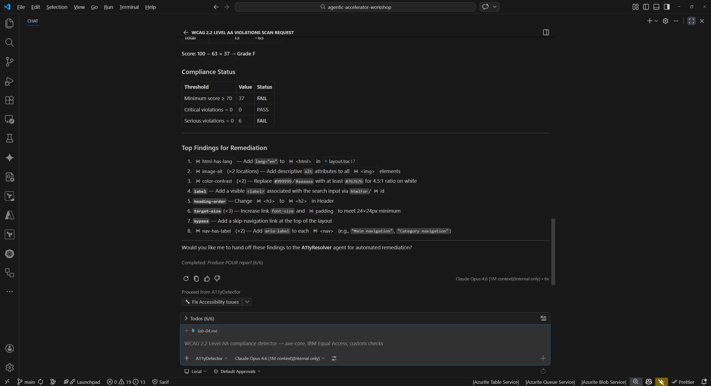
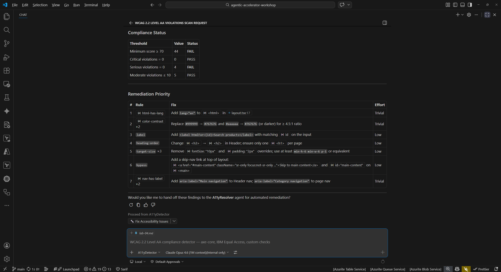

## Overview

| | |
|---|---|
| **Duration** | 35 minutes |
| **Level** | Intermediate |
| **Prerequisites** | [Lab 00](lab-00-setup.md), [Lab 01](lab-01.md), [Lab 02](lab-02.md) |

## Learning Objectives

By the end of this lab, you will be able to:

* Run the a11y-detector to find WCAG 2.2 Level AA violations
* Use the a11y-scan prompt template for targeted component scanning
* Try the a11y-resolver handoff for automated accessibility fixes
* Map findings to WCAG success criteria references

## Exercises

### Exercise 4.1: Full Accessibility Scan

Start with a broad scan of the entire sample app source directory.

1. Open the Copilot Chat panel (`Ctrl+Shift+I`).
2. Type the following prompt:

   ```text
   @a11y-detector Scan sample-app/src/ for WCAG 2.2 Level AA violations
   ```

3. Wait for the detector to complete its analysis. Review the output and look for findings such as:

   | Finding | WCAG Criterion | File |
   |---|---|---|
   | Missing `lang` attribute on `<html>` element | 3.1.1 Language of Page | `sample-app/src/app/layout.tsx` |
   | Insufficient color contrast ratios | 1.4.3 Contrast (Minimum) | `sample-app/src/app/globals.css` |
   | Missing form labels or `aria-label` attributes | 1.3.1 Info and Relationships | `sample-app/src/app/products/page.tsx` |
   | Touch targets smaller than 44x44 CSS pixels | 2.5.8 Target Size (Minimum) | Multiple components |

4. Count the total number of violations reported. The detector should find at least 5 distinct issues.



### Exercise 4.2: Targeted Component Scan with Prompt File

Instead of scanning the entire directory, use the a11y-scan prompt file to focus on a single component.

1. In Copilot Chat, type:

   ```text
   /a11y-scan component=sample-app/src/app/page.tsx
   ```

2. Compare the targeted output to the full scan from Exercise 4.1. Notice that the targeted scan focuses on a single component and provides more detailed findings for that file.
3. The prompt file approach is useful when you want to check a specific component during development rather than scanning the entire project.



### Exercise 4.3: Handoff to Resolver

Now try the detector-to-resolver handoff pattern you learned about in Lab 02.

1. From the detector output in Exercise 4.1, identify the missing `lang` attribute finding.
2. In Copilot Chat, type:

   ```text
   @a11y-resolver Fix the missing lang attribute in sample-app/src/app/layout.tsx
   ```

3. Review the proposed fix. The resolver should suggest adding `lang="en"` to the `<html>` element in `layout.tsx`.
4. Examine the code change the resolver proposes. Verify that it addresses the WCAG 3.1.1 violation without introducing new issues.
5. Optionally, accept the fix and re-run the detector to confirm the violation is resolved.


### Exercise 4.4: Map Findings to WCAG Criteria

Review all findings from the exercises above and map each one to its WCAG 2.2 success criterion.

1. Create a reference table for your findings:

   | Finding | WCAG Criterion | Level | Principle |
   |---|---|---|---|
   | Missing `lang` attribute | 3.1.1 Language of Page | A | Understandable |
   | Low color contrast | 1.4.3 Contrast (Minimum) | AA | Perceivable |
   | Missing form labels | 1.3.1 Info and Relationships | A | Perceivable |
   | Small touch targets | 2.5.8 Target Size (Minimum) | AA | Operable |
   | Missing alt text on images | 1.1.1 Non-text Content | A | Perceivable |

2. Consider why accessibility matters beyond compliance:

   * Users with visual impairments rely on screen readers that need proper semantic markup.
   * Users with motor impairments need adequately sized touch targets.
   * Users with cognitive disabilities benefit from clear, well-structured content.
   * Accessible applications are often more usable for everyone.

3. Note the WCAG conformance levels (A, AA, AAA). Level AA is the standard most organizations target for compliance.


## Verification Checkpoint

Before proceeding, verify:

* [ ] The a11y-detector found at least 5 WCAG 2.2 Level AA violations
* [ ] You used the `/a11y-scan` prompt file for a targeted component scan
* [ ] The a11y-resolver proposed at least 2 fixes for detected violations
* [ ] You can map each finding to a specific WCAG success criterion
* [ ] You understand the detect → fix → verify cycle from Lab 02

## Next Steps

Proceed to [Lab 05 — Code Quality Analysis with Copilot Agents](lab-05.md).