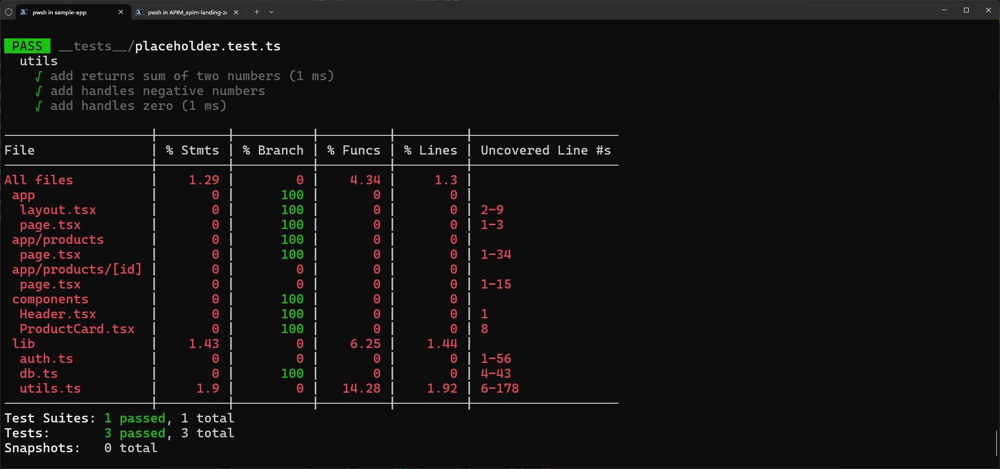
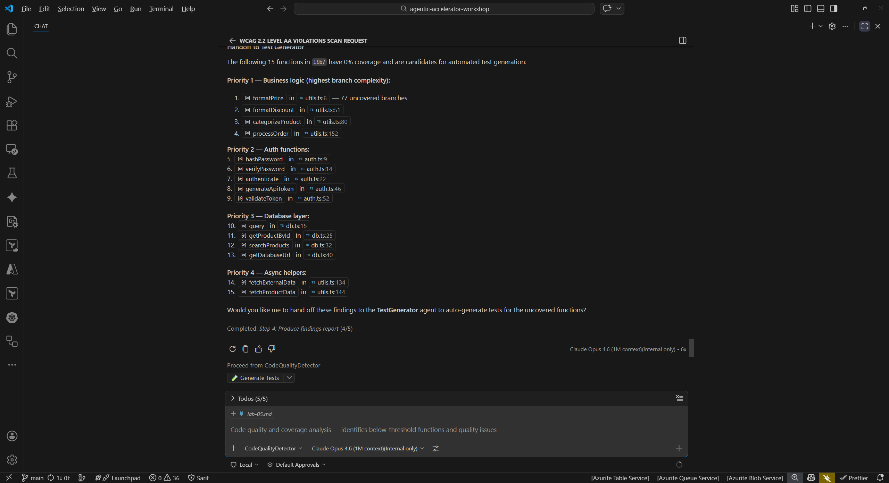
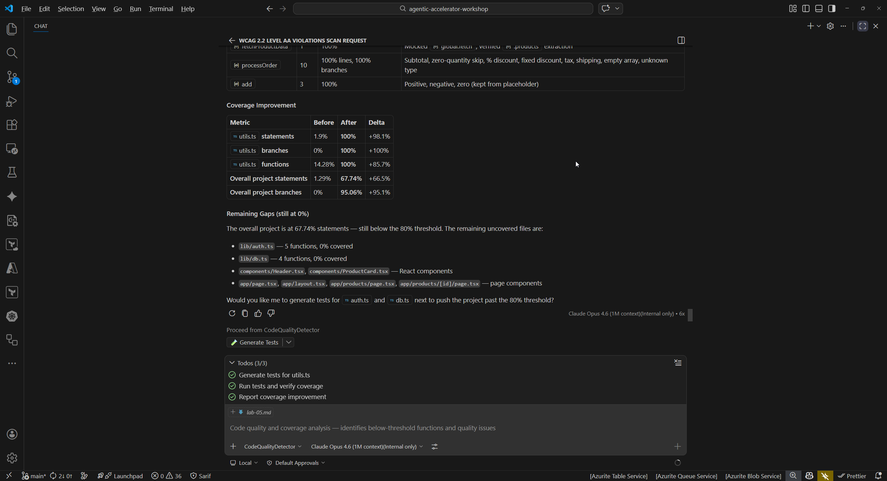

## Overview

| | |
|---|---|
| **Duration** | 35 minutes |
| **Level** | Intermediate |
| **Prerequisites** | [Lab 00](lab-00-setup.md), [Lab 01](lab-01.md), [Lab 02](lab-02.md) |

## Learning Objectives

By the end of this lab, you will be able to:

* Run test coverage and understand the coverage gap in the sample app
* Run the code-quality-detector to find quality issues including coverage, complexity, and maintainability
* Use the test-generator to create unit tests for uncovered code
* Observe coverage improvement after applying generated tests

## Exercises

### Exercise 5.1: Measure Current Coverage

Before running any agents, establish a baseline by measuring the current test coverage.

1. Open a terminal in VS Code (`Ctrl+`` `) and navigate to the sample app:

   ```bash
   cd sample-app
   ```

2. Run the test suite with coverage reporting:

   ```bash
   npm test -- --coverage
   ```

3. Review the coverage output. You should see coverage around 5% because only a placeholder test exists in `__tests__/placeholder.test.ts`.
4. Note the specific files and functions with 0% coverage. These are the targets for later exercises.



### Exercise 5.2: Code Quality Detection

Use the Code Quality Detector agent to get a comprehensive quality analysis.

1. Open the Copilot Chat panel (`Ctrl+Shift+I`).
2. Type the following prompt:

   ```text
   @code-quality-detector Analyze sample-app/ for code quality issues including coverage, complexity, and maintainability
   ```

3. Review the findings. The detector should identify issues such as:

   | Finding | Category | File |
   |---|---|---|
   | Test coverage below 80% threshold | Coverage | Project-wide |
   | High cyclomatic complexity | Complexity | `sample-app/src/lib/utils.ts` |
   | Use of `any` type annotations | Type Safety | Multiple files |
   | Code duplication in utility functions | Maintainability | `sample-app/src/lib/` |
   | Missing error handling | Reliability | `sample-app/src/lib/db.ts` |

4. Note which findings the detector flags as highest priority. Low coverage and type safety issues are common starting points for improvement.



### Exercise 5.3: Generate Tests

Use the Test Generator agent to create unit tests for one of the uncovered files.

1. In Copilot Chat, type:

   ```text
   @test-generator Generate unit tests for sample-app/src/lib/utils.ts to improve coverage
   ```

2. Review the generated test file. The agent should produce tests that cover:

   * Each exported function in `utils.ts`
   * Edge cases (null inputs, empty strings, boundary values)
   * Expected return values for common inputs

3. Examine the test structure. The generated tests should use Jest syntax (`describe`, `it`, `expect`) consistent with the project configuration in `jest.config.ts`.



### Exercise 5.4: Apply Tests and Re-measure (Optional)

Apply the generated tests and measure the coverage improvement.

1. Copy the generated test code into a new file:

   ```bash
   # Create the test file (paste the generated content)
   code sample-app/__tests__/utils.test.ts
   ```

2. Save the file with the generated test content from Exercise 5.3.
3. Re-run the test suite with coverage:

   ```bash
   cd sample-app
   npm test -- --coverage
   ```

4. Compare the new coverage percentage to the baseline from Exercise 5.1. You should see a measurable improvement in the coverage for `src/lib/utils.ts`.
5. This exercise demonstrates the detect → generate → verify cycle from Lab 02: the Code Quality Detector identified the gap, the Test Generator produced tests, and re-running coverage confirms the improvement.


## Verification Checkpoint

Before proceeding, verify:

* [ ] You measured the baseline test coverage (approximately 5%)
* [ ] The code-quality-detector identified low coverage, complexity, or type safety issues
* [ ] The test-generator produced unit tests for `utils.ts`
* [ ] (Optional) You applied the generated tests and observed improved coverage
* [ ] You understand the detect → generate → verify cycle for code quality

## Next Steps

Proceed to [Lab 06](lab-06.md).