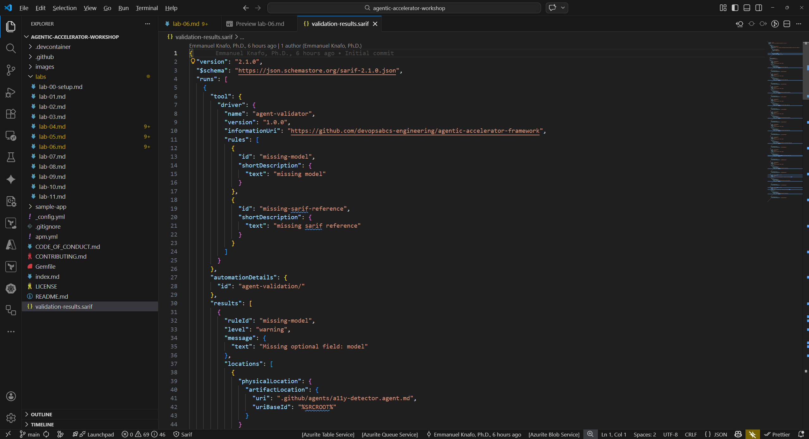
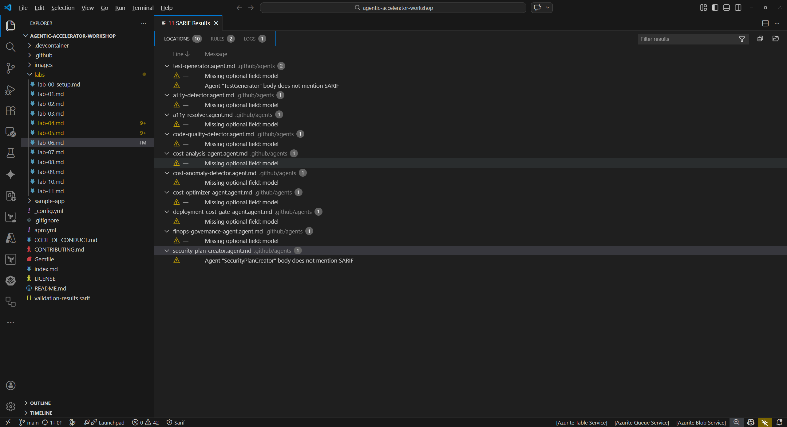
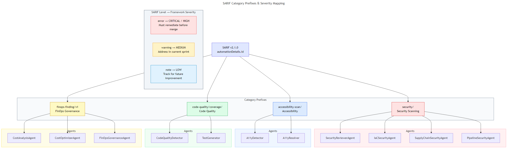

## Overview

| | |
|---|---|
| **Duration** | 30 minutes |
| **Level** | Intermediate |
| **Prerequisites** | At least one of [Lab 03](lab-03.md), [Lab 04](lab-04.md), or [Lab 05](lab-05.md) |

## Learning Objectives

By the end of this lab, you will be able to:

* Understand the SARIF v2.1.0 JSON structure and its key fields
* Navigate SARIF findings using the SARIF Viewer extension in VS Code
* Explain the category prefix system used by the Agentic Accelerator Framework
* Connect SARIF output to the GitHub Security tab ingestion pipeline

## Exercises

### Exercise 6.1: Examine Raw SARIF

Open the SARIF file and explore its JSON structure to understand how agent findings are stored.

1. In VS Code, open `validation-results.sarif` from the repository root. The file opens as a standard JSON document.
2. Locate the top-level `$schema` field. This points to the SARIF v2.1.0 JSON schema and tells processors which specification version to validate against.
3. Find the `version` field. It should read `"2.1.0"`.
4. Expand the `runs[]` array. Each run represents one tool execution. Inside a run, identify these fields:

   | Field | Purpose |
   |---|---|
   | `tool.driver.name` | Name of the agent or scanner that produced the results |
   | `tool.driver.rules[]` | Rule definitions with unique `ruleId` values per finding type |
   | `results[]` | Array of individual findings |
   | `automationDetails.id` | Category string used for grouping (for example, `security/`) |

5. Inside a single result entry, locate:

   | Field | Purpose |
   |---|---|
   | `ruleId` | Unique identifier for the rule that triggered the finding |
   | `level` | Severity level (`error`, `warning`, or `note`) |
   | `message.text` | Human-readable description of the finding |
   | `locations[]` | File path and line number where the issue was detected |
   | `partialFingerprints` | Stable hashes used for deduplication across multiple runs |

6. Count how many runs exist in the file and note which tools produced them.



### Exercise 6.2: Use SARIF Viewer Extension

The SARIF Viewer extension provides a graphical interface for navigating findings without reading raw JSON.

1. Right-click `validation-results.sarif` in the VS Code Explorer panel.
2. Select **Open with SARIF Viewer** from the context menu. If the option does not appear, confirm the SARIF Viewer extension is installed (see Lab 00 setup).
3. The viewer displays a findings tree grouped by tool and severity. Expand a tool node to see its individual findings.



4. Click any finding in the tree. The viewer opens the referenced source file and highlights the exact line where the issue was detected.
5. Compare the source location shown in the viewer to the `locations[]` field you examined in Exercise 6.1. Both should point to the same file and line number.


### Exercise 6.3: SARIF Category Prefixes

The Agentic Accelerator Framework uses category prefixes in the `automationDetails.id` field to organize findings by domain.

1. Review the category prefix system:

   | Prefix | Domain | Example Agents |
   |---|---|---|
   | `security/` | Security scanning | SecurityReviewerAgent, IaC Security Agent, Supply Chain Agent |
   | `accessibility-scan/` | Accessibility | A11Y Detector, A11Y Resolver |
   | `code-quality/coverage/` | Code quality | Code Quality Detector, Test Generator |
   | `finops-finding/v1` | FinOps governance | Cost Analysis Agent, Cost Optimizer Agent |

2. Understand the severity mapping between SARIF levels and framework classification:

   | SARIF Level | Framework Severity | Action Required |
   |---|---|---|
   | `error` | CRITICAL or HIGH | Must remediate before merge |
   | `warning` | MEDIUM | Address in current sprint |
   | `note` | LOW | Track for future improvement |

3. Return to the raw SARIF file and search for `automationDetails` entries. Identify which category prefix each run uses.
4. For security findings, the framework maps to CWE IDs (for example, CWE-79 for XSS) and OWASP Top 10 categories. For accessibility findings, the mapping references WCAG 2.2 success criteria.



### Exercise 6.4: How GitHub Ingests SARIF

This exercise explains the pipeline from SARIF file to GitHub Security tab. Labs 07 and 08 will walk you through the process hands-on.

1. Understand the SARIF upload flow:

   ```text
   Agent produces findings
        ↓
   Results written as SARIF v2.1.0 JSON
        ↓
   GitHub Actions workflow runs upload-sarif action
        ↓
   GitHub Code Scanning processes the SARIF file
        ↓
   Findings appear in Security → Code scanning alerts
   ```

2. The `github/codeql-action/upload-sarif@v4` action in each workflow handles the upload. The `category` input on the upload step matches the `automationDetails.id` prefix so GitHub can group alerts by domain.
3. Once uploaded, GitHub deduplicates findings using `partialFingerprints`. A finding that already exists from a previous run will not create a duplicate alert.
4. In Lab 07, you will enable GitHub Actions and trigger these workflows with a pull request. In Lab 08, you will explore the uploaded results in the Security tab.

## Verification Checkpoint

Before proceeding, verify:

* [ ] You can identify the five key SARIF fields: `$schema`, `version`, `runs[]`, `results[]`, and `partialFingerprints`
* [ ] You opened the SARIF file in the SARIF Viewer extension and navigated to a source location
* [ ] You can explain the four category prefixes and which domain each represents
* [ ] You understand the severity mapping from SARIF levels to framework classification
* [ ] You can describe the flow from SARIF file to GitHub Security tab

## Next Steps

Proceed to [Lab 07](lab-07.md) to enable GitHub Actions workflows and trigger them with a pull request.