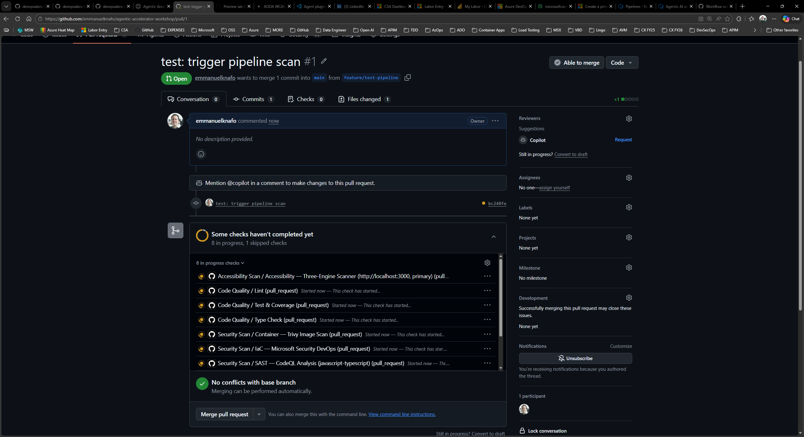

## Overview

| | |
|---|---|
| **Duration** | 40 minutes |
| **Level** | Intermediate |
| **Prerequisites** | [Lab 00](lab-00-setup.md) through [Lab 06](lab-06.md) |

## Learning Objectives

By the end of this lab, you will be able to:

* Understand the structure of the workshop GitHub Actions workflows
* Enable GitHub Actions and configure workflow permissions in your repository
* Create a branch, make changes, and open a pull request to trigger workflows
* Monitor workflow execution and review logs in the Actions tab

## Exercises

### Exercise 7.1: Review Workflow Files

Explore the four workflow files included in the repository to understand what each one does.

1. Open `.github/workflows/security-scan.yml` in VS Code. This is the most comprehensive workflow in the set.
2. Identify the key structural elements:

   | Element | Value | Purpose |
   |---|---|---|
   | `on.push.branches` | `[main]` | Triggers on pushes to main |
   | `on.pull_request.branches` | `[main]` | Triggers on PRs targeting main |
   | `permissions.security-events` | `write` | Allows SARIF upload to Security tab |
   | `jobs` | Multiple jobs | SCA, SAST, IaC, Container, DAST scans |

3. Locate the SARIF upload step within one of the jobs. It uses `github/codeql-action/upload-sarif@v4` to send findings to the GitHub Security tab.
4. Review the remaining three workflows briefly:

   | Workflow File | Name | Trigger | SARIF Category |
   |---|---|---|---|
   | `accessibility-scan.yml` | Accessibility Scan | PR + weekly schedule | `accessibility-scan/` |
   | `code-quality.yml` | Code Quality | PR only | `code-quality/coverage/` |
   | `finops-cost-gate.yml` | FinOps Cost Gate | PR (infra file changes) | `finops-finding/` |

5. Note that all four workflows upload SARIF to the Security tab. The different `category` values ensure findings are grouped by domain.


### Exercise 7.2: Enable GitHub Actions

Confirm that GitHub Actions is enabled and permissions are configured correctly for your forked repository.

1. Navigate to your repository on GitHub.
2. Go to **Settings** → **Actions** → **General**.
3. Under **Actions permissions**, select **Allow all actions and reusable workflows**. This is required because the workflows reference third-party actions such as `anchore/sbom-action` and `github/codeql-action`.
4. Scroll to **Workflow permissions**.
5. Select **Read and write permissions** for the `GITHUB_TOKEN`. The workflows need write access to upload SARIF files to the Security tab.
6. Check **Allow GitHub Actions to create and approve pull requests** if available.
7. Click **Save** to apply the changes.

> [!TIP]
> If your organization enforces stricter policies, you may need to ask an administrator to allow the specific actions used in these workflows.

### Exercise 7.3: Trigger Workflows with a Pull Request

Create a branch, make a small change, and open a pull request to trigger the workflow runs.

1. Open a terminal in VS Code and create a new branch:

   ```bash
   git checkout -b feature/test-pipeline
   ```

2. Open `sample-app/src/app/page.tsx` and make a visible change. For example, add a comment at the top of the file:

   ```tsx
   // Test change to trigger pipeline workflows
   ```

3. Stage, commit, and push the change:

   ```bash
   git add sample-app/src/app/page.tsx
   git commit -m "test: trigger pipeline scan"
   git push -u origin feature/test-pipeline
   ```

4. Open your repository in a browser. GitHub should display a banner suggesting you create a pull request for the recently pushed branch.
5. Click **Compare & pull request**.
6. Set the target branch to `main`, add a descriptive title such as "Test pipeline trigger", and click **Create pull request**.



### Exercise 7.4: Monitor Workflow Execution

Watch the workflows run and explore the execution logs.

1. In your pull request, scroll down to the checks section. You should see workflow runs starting to appear.
2. Click the **Actions** tab at the top of the repository page.
3. Locate the triggered workflow runs. You should see at least the Security Scan and Code Quality workflows running (the Accessibility Scan and FinOps Cost Gate may also trigger depending on your changes).


4. Click a running workflow to view its details. You will see each job listed with its current status (queued, in progress, or completed).
5. Click a specific job to expand its step-by-step logs. Look for:

   * Checkout and setup steps completing first
   * Scanning tools executing and producing output
   * SARIF upload steps sending results to the Security tab

6. Wait for all workflows to complete. Green checkmarks indicate successful completion. If a workflow fails, click it to review the error logs.


> [!IMPORTANT]
> Do not merge or close this pull request yet. Lab 08 requires the workflow results to be available in the Security tab.

## Verification Checkpoint

Before proceeding, verify:

* [ ] You reviewed the structure of `security-scan.yml` and identified trigger events, jobs, and the SARIF upload step
* [ ] GitHub Actions is enabled with "Allow all actions" and "Read and write permissions"
* [ ] You created a branch, pushed a change, and opened a pull request targeting `main`
* [ ] At least two workflows were triggered by the pull request
* [ ] You can navigate to the Actions tab and view workflow logs

## Next Steps

Proceed to [Lab 08](lab-08.md) to explore the uploaded SARIF results in the GitHub Security tab.