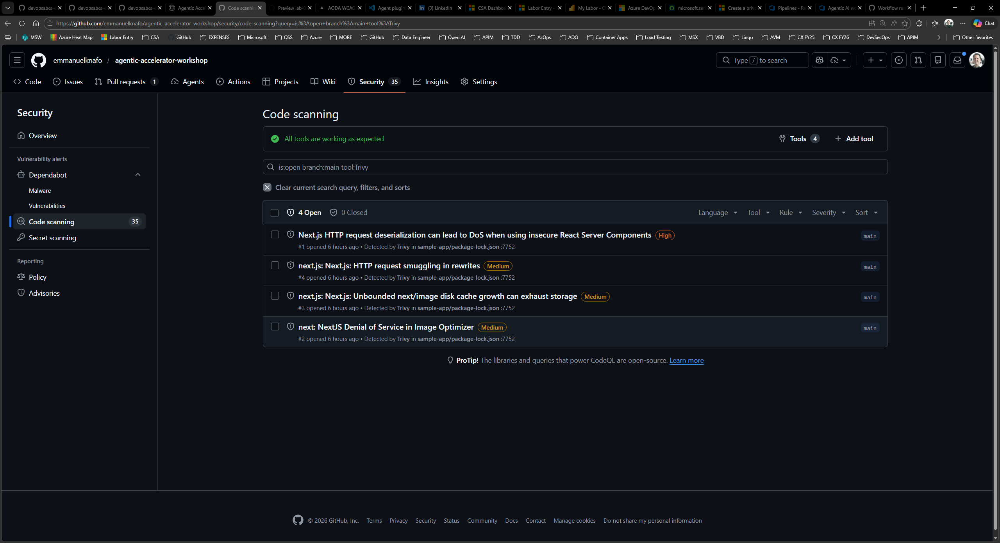
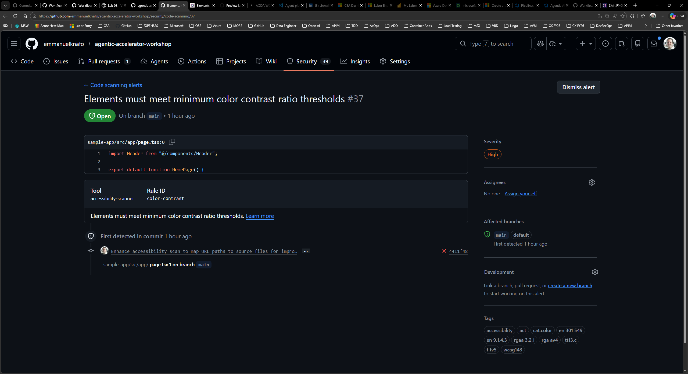
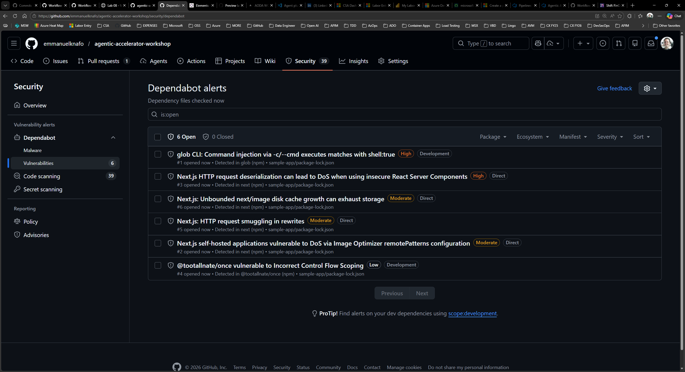
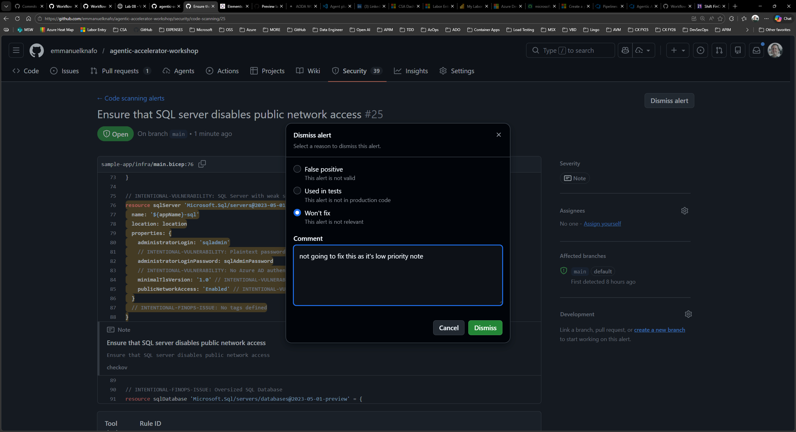

## Overview

| | |
|---|---|
| **Duration** | 25 minutes |
| **Level** | Intermediate |
| **Prerequisites** | [Lab 07](lab-07.md) (workflows completed) |

## Learning Objectives

By the end of this lab, you will be able to:

* Navigate the GitHub Security tab and locate Code Scanning alerts
* Filter alerts by tool, severity, and category prefix
* View finding details including rule description, severity, file path, and code snippet
* Explore Dependabot alerts for dependency vulnerabilities
* Manage alerts by dismissing findings or creating GitHub Issues

## Exercises

### Exercise 8.1: Navigate to Security Tab

Locate the Security tab where GitHub aggregates all scanning results.

1. Open your repository on GitHub.
2. Click the **Security** tab in the top navigation bar. If you do not see it, click the **...** (more) menu to reveal additional tabs.
3. In the left sidebar, click **Code scanning alerts**. This page displays all findings uploaded from your GitHub Actions workflows via SARIF.
4. Review the alerts overview. GitHub groups alerts by state (Open, Closed) and shows a count for each severity level.

### Exercise 8.2: Filter and Explore Alerts

Use the filter controls to narrow alerts by tool, severity, and category.

1. Click the **Tool** dropdown and select one of the scanning tools (for example, the security scanner). The list updates to show only alerts from that tool.
2. Click the **Severity** dropdown and filter by **Error**. These correspond to CRITICAL and HIGH severity findings from the framework.
3. Try filtering by category prefix by typing a prefix such as `security/` or `code-quality/` in the search bar. GitHub uses the `automationDetails.id` field from the SARIF file to support this filtering.
4. Combine multiple filters to focus on the most relevant findings. For example, filter by tool and severity together to see only high-priority security alerts.
5. Note the total count of alerts for each filter combination. This gives you a sense of the finding distribution across domains and severity levels.

### Exercise 8.3: View Finding Details

Click into an individual finding to see the full detail view.

1. Click any alert in the list to open its detail page.
2. Review the information displayed:

   | Section | Description |
   |---|---|
   | Rule description | Explanation of what the rule checks and why it matters |
   | Severity | SARIF level mapped to GitHub severity (Error, Warning, Note) |
   | File path | Exact file where the issue was detected |
   | Line number | Specific line in the source code |
   | Code snippet | Highlighted code context around the finding |
   | Rule ID | Unique identifier matching `ruleId` in the SARIF file |

3. Compare this information to what you saw in Exercise 6.1 when examining the raw SARIF. The fields map directly: `ruleId` to Rule ID, `level` to Severity, `locations[]` to File path and Line number, `message.text` to the description.
4. If the finding references a CWE or WCAG criterion, click the link to view the standard description.

### Exercise 8.4: Explore Dependabot Alerts

Review dependency vulnerability alerts separately from code scanning.

1. Return to the **Security** tab.
2. In the left sidebar, click **Dependabot alerts**.
3. Dependabot monitors your `package.json` and other manifest files for known vulnerabilities in third-party dependencies.
4. If alerts are present, click one to review:

   * The affected package name and version
   * The vulnerability severity and CVE identifier
   * The recommended fix (usually a version upgrade)
   * Whether Dependabot can generate an automated pull request to fix it

5. If no Dependabot alerts appear, this means your current dependencies have no known vulnerabilities at this time.

> [!TIP]
> Dependabot alerts operate separately from SARIF uploads. SARIF-based code scanning covers application and infrastructure issues found by agents, while Dependabot covers known CVEs in third-party packages.

### Exercise 8.5: Manage Alerts

Practice the alert lifecycle by dismissing a finding and creating an issue from another.

1. Return to **Code scanning alerts**.
2. Select a low-priority alert (Note severity) that you want to dismiss.
3. Click **Dismiss alert** and choose a reason:

   | Reason | When to Use |
   |---|---|
   | **Won't fix** | The finding is valid but does not apply to your context |
   | **False positive** | The finding is incorrect and the code is not vulnerable |
   | **Used in tests** | The flagged pattern exists only in test code |

4. The alert moves to the Closed state. You can reopen it later if needed.
5. Select a different alert that warrants tracking.
6. Click **Create issue** (or use the kebab menu to find this option). GitHub creates a new Issue pre-populated with the finding details including the rule, file, and description.
7. Review the created Issue. It contains enough context for a developer to understand and remediate the finding without returning to the Security tab.

## Verification Checkpoint

Before proceeding, verify:

* [ ] You navigated to the Security tab and located Code Scanning alerts
* [ ] You filtered alerts by tool, severity, and category prefix
* [ ] You opened a finding detail page and identified the rule, severity, file path, and code snippet
* [ ] You explored the Dependabot alerts section
* [ ] You dismissed at least one alert and created a GitHub Issue from another

## Next Steps

Proceed to [Lab 09](lab-09.md) to explore FinOps governance and cost analysis with Copilot agents.