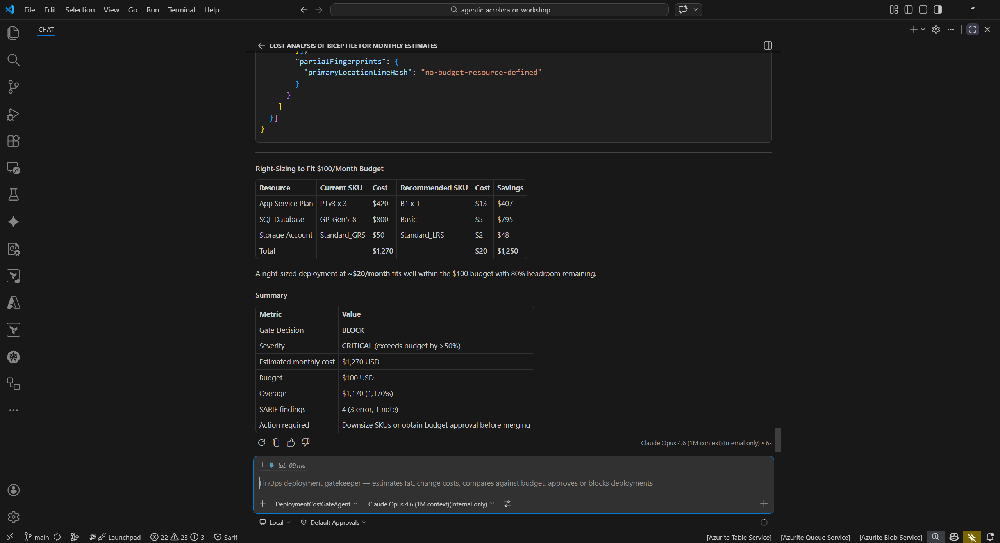

## Overview

| | |
|---|---|
| **Duration** | 45 minutes |
| **Level** | Advanced (Optional) |
| **Prerequisites** | [Lab 00](lab-00-setup.md), [Lab 01](lab-01.md), [Lab 02](lab-02.md) |

> [!IMPORTANT]
> This lab is **optional** and requires an Azure subscription with **Cost Management Reader** role assigned to your account. You can complete the exercises using Copilot Chat agent prompts without deploying resources, but an Azure subscription provides richer context for cost analysis.

## Learning Objectives

By the end of this lab, you will be able to:

* Run the cost-analysis-agent to estimate infrastructure deployment costs from Bicep templates
* Use the finops-governance-agent to check tag compliance against organizational policies
* Use the deployment-cost-gate-agent to enforce budget thresholds before deployment
* Understand right-sizing recommendations and their cost impact

## Exercises

### Exercise 9.1: Cost Analysis

Use the Cost Analysis Agent to estimate monthly costs for the sample app infrastructure.

1. Open the Copilot Chat panel (`Ctrl+Shift+I`).
2. Type the following prompt:

   ```text
   @cost-analysis-agent Analyze sample-app/infra/main.bicep for estimated monthly costs
   ```

3. Wait for the agent to complete its analysis. Review the cost breakdown. The agent should identify these high-cost resources:

   | Resource | SKU | Estimated Monthly Cost |
   |---|---|---|
   | App Service Plan | P1v3 (3 instances) | ~$420 |
   | SQL Database | GP_Gen5_8 (8 vCores) | ~$800 |
   | Storage Account | Standard_GRS | ~$50 |
   | **Total** | | **~$1,270** |

4. Note that the sample app uses premium-tier SKUs that far exceed what a sample application requires. This is intentional to demonstrate cost governance capabilities.


### Exercise 9.2: Tag Governance

Check whether the infrastructure template follows organizational tagging policies.

1. In Copilot Chat, type:

   ```text
   @finops-governance-agent Check sample-app/infra/main.bicep for tag compliance
   ```

2. Review the findings. The agent should identify missing tags that organizations typically require:

   | Missing Tag | Purpose |
   |---|---|
   | `costCenter` | Maps resources to a billing cost center |
   | `environment` | Identifies the deployment stage (dev, staging, production) |
   | `owner` | Designates the responsible team or individual |

3. Consider why tag compliance matters: without proper tags, organizations cannot accurately allocate cloud costs to teams, track spending by environment, or enforce accountability.


### Exercise 9.3: Cost Gate

Apply a budget threshold to determine whether the deployment should proceed.

1. In Copilot Chat, type:

   ```text
   @deployment-cost-gate-agent Evaluate sample-app/infra/ against a $100/month budget
   ```

2. Review the cost gate result. The agent should report that the estimated monthly cost (~$1,270) exceeds the $100/month budget by approximately $1,170.
3. In a real CI/CD pipeline, this cost gate would block the deployment and require either budget approval or infrastructure changes before proceeding.
4. Consider how cost gates prevent unexpected cloud spending: teams set a budget threshold, and the gate rejects deployments that would exceed it.



### Exercise 9.4: Right-Sizing (Optional)

Reduce costs by switching to appropriately sized SKUs and verify the impact.

1. Open `sample-app/infra/variables.bicep` in the editor.
2. Locate the `appServiceSkuName` parameter and change the default value from `P1v3` to `B1`.
3. Locate the `sqlDatabaseSkuName` parameter and change the default value from `GP_Gen5_8` to `Basic`.
4. Save the file.
5. Re-run the cost analysis agent:

   ```text
   @cost-analysis-agent Analyze sample-app/infra/main.bicep for estimated monthly costs
   ```

6. Compare the new estimate against the original. The right-sized deployment should cost approximately $30/month, a reduction of over 97%.
7. **Revert your changes** to `variables.bicep` after completing this exercise so the intentional issues remain for other labs. Use `Ctrl+Z` or run `git checkout sample-app/infra/variables.bicep`.


## Verification Checkpoint

Before proceeding, verify:

* [ ] The cost-analysis-agent estimated monthly costs for the sample app infrastructure
* [ ] The finops-governance-agent identified at least 3 missing tags
* [ ] The deployment-cost-gate-agent flagged the budget breach against a $100/month threshold
* [ ] You identified at least 3 optimization opportunities across all exercises

## Next Steps

Proceed to [Lab 10 — Agent Remediation Workflows](lab-10.md).