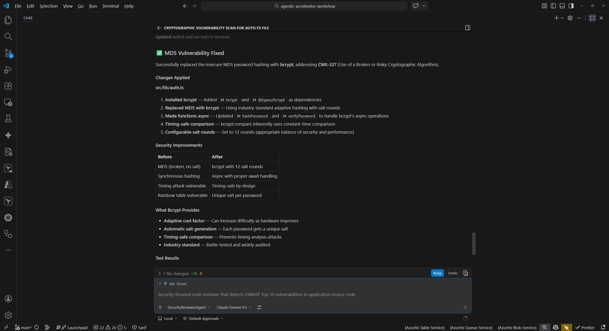
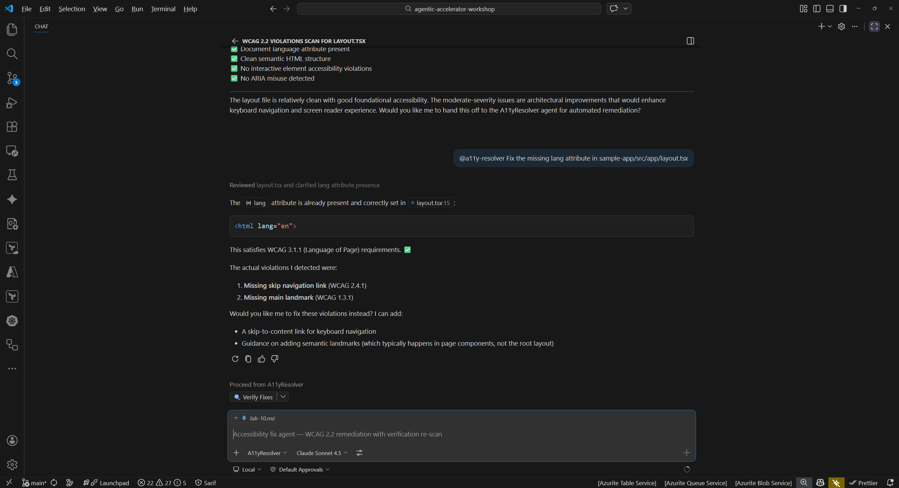

## Overview

| | |
|---|---|
| **Duration** | 45 minutes |
| **Level** | Advanced |
| **Prerequisites** | [Lab 03](lab-03.md), [Lab 04](lab-04.md), or [Lab 05](lab-05.md) (at least one scanning lab) |

## Learning Objectives

By the end of this lab, you will be able to:

* Complete a full Detect-Fix-Verify cycle for security vulnerabilities
* Use the accessibility resolver agent to remediate WCAG findings
* Generate tests with the test-generator agent and confirm improved coverage
* Commit remediation changes with descriptive messages following project conventions

## Exercises

### Exercise 10.1: Security Remediation Cycle

Detect a cryptographic vulnerability, apply the fix, and verify the issue is resolved.

**Detect:**

1. Open the Copilot Chat panel (`Ctrl+Shift+I`).
2. Type the following prompt to scan for security issues:

   ```text
   @security-reviewer-agent Scan sample-app/src/lib/auth.ts for cryptographic vulnerabilities
   ```

3. The agent should identify the use of MD5 hashing (CWE-328: Use of Weak Hash). MD5 is cryptographically broken and unsuitable for password hashing or integrity verification.

**Fix:**

4. Ask the agent to remediate the finding:

   ```text
   @security-reviewer-agent Fix the MD5 weak hashing in sample-app/src/lib/auth.ts. Replace with bcrypt or argon2.
   ```

5. Review the proposed changes. The agent should replace the MD5 usage with a secure hashing algorithm such as `bcrypt` or `argon2`.
6. Apply the suggested changes to the file.

**Verify:**

7. Re-run the security scan on the same file:

   ```text
   @security-reviewer-agent Scan sample-app/src/lib/auth.ts for cryptographic vulnerabilities
   ```

8. Confirm the MD5 finding (CWE-328) no longer appears in the results.



### Exercise 10.2: Accessibility Remediation Cycle

Detect a WCAG violation, apply the fix using the resolver agent, and verify the result.

**Detect:**

1. In Copilot Chat, run an accessibility scan:

   ```text
   @a11y-detector Scan sample-app/src/app/layout.tsx for WCAG 2.2 violations
   ```

2. The agent should identify that the `<html>` element is missing the `lang` attribute, a WCAG 3.1.1 Level A violation. This attribute tells screen readers which language the page content is in.

**Fix:**

3. Use the accessibility resolver to apply the fix:

   ```text
   @a11y-resolver Fix the missing lang attribute in sample-app/src/app/layout.tsx
   ```

4. Review the proposed change. The agent should add `lang="en"` (or the appropriate locale) to the `<html>` element.
5. Apply the change.

**Verify:**

6. Re-run the accessibility scan:

   ```text
   @a11y-detector Scan sample-app/src/app/layout.tsx for WCAG 2.2 violations
   ```

7. Confirm the missing `lang` attribute finding no longer appears.



### Exercise 10.3: Code Quality Remediation Cycle

Detect missing test coverage, generate tests, and verify improved coverage.

**Detect:**

1. Run a code quality scan:

   ```text
   @code-quality-detector Scan sample-app/src/lib/utils.ts for code quality issues
   ```

2. The agent should identify that `utils.ts` has no corresponding test file. Lack of test coverage is a code quality risk that makes refactoring unsafe and regressions harder to catch.

**Fix:**

3. Use the test generator to create tests:

   ```text
   @test-generator Generate unit tests for sample-app/src/lib/utils.ts
   ```

4. Review the generated test file. The agent should produce tests covering the exported functions in `utils.ts`.
5. Apply the generated test file to your project.

**Verify:**

6. Run the test suite to confirm the new tests pass and coverage has improved:

   ```text
   @code-quality-detector Check test coverage for sample-app/src/lib/utils.ts
   ```

7. Compare the coverage before and after adding the tests. The new tests should increase line and branch coverage for `utils.ts`.


### Exercise 10.4: Commit Your Fixes

Stage and commit the remediation changes with a descriptive commit message.

1. Open the VS Code Source Control panel (`Ctrl+Shift+G`).
2. Review the changed files. You should see modifications from the exercises above:

   * `sample-app/src/lib/auth.ts` (security fix)
   * `sample-app/src/app/layout.tsx` (accessibility fix)
   * New test file(s) for `utils.ts` (code quality fix)

3. Stage the files you want to commit.
4. Write a descriptive commit message that references the types of fixes applied. For example:

   ```text
   fix: remediate security, a11y, and coverage findings from agent scans
   ```

5. Commit the changes.
6. Consider the pull request workflow: in a team environment, you would push this branch and open a PR for review. The PR description would reference the findings that were resolved, making it easy for reviewers to understand the purpose of each change.

> [!TIP]
> In a real project, you might split these fixes into separate commits or PRs grouped by domain (security fixes in one PR, accessibility in another). This makes reviews more focused and rollbacks more granular.

## Verification Checkpoint

Before proceeding, verify:

* [ ] You completed at least 1 full Detect-Fix-Verify cycle
* [ ] The re-scan confirmed the original finding was resolved
* [ ] You committed the remediation changes with a descriptive message

## Next Steps

Proceed to [Lab 11 — Creating Your Own Custom Agent](lab-11.md).